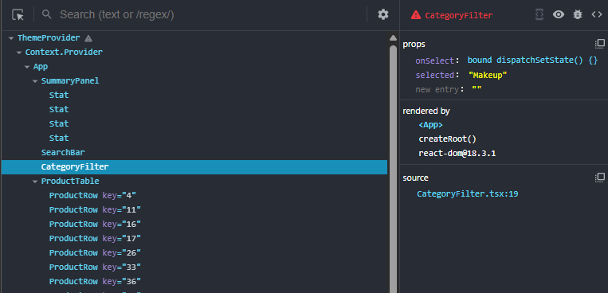
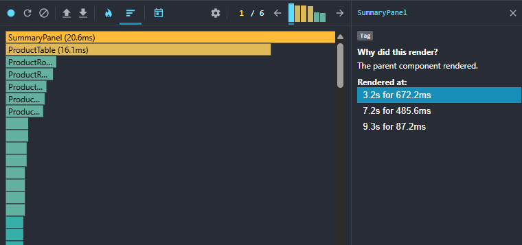
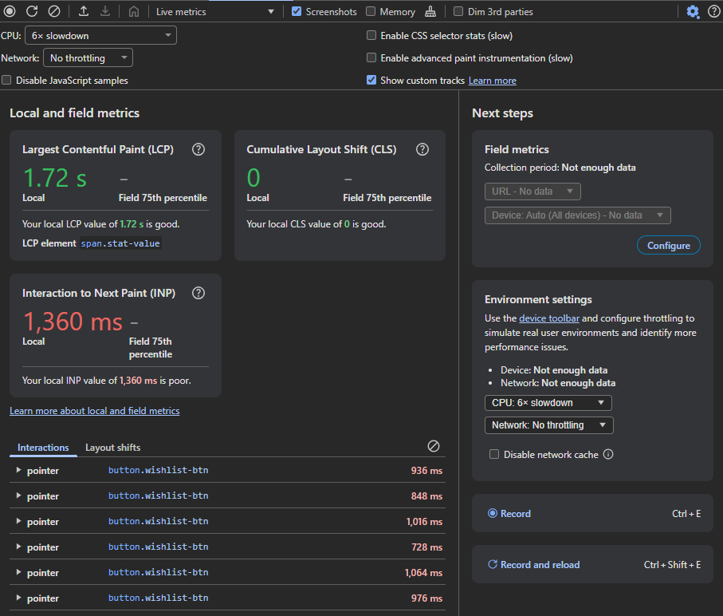
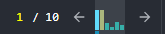
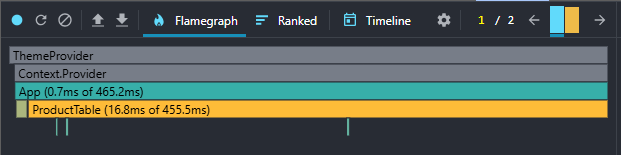
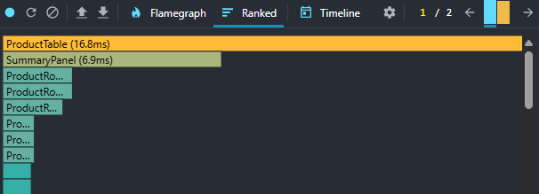
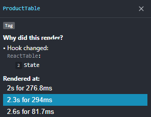

<!-- _class: invert lead -->
<!-- _paginate: false -->
<!-- _header: '' -->

# The React Profiler

### Find what's slow. Prove what's fast.

Knowledge sharing → hands-on hackathon

---

# What it helps you find & fix

- ⌨️ **Typing feels laggy** — every keystroke re-renders the world
- 💥 **Small click → whole page re-renders**
- 🔁 **A component re-renders for no reason**
- ✅ **Proving an optimization actually worked**

> Measure, don't guess.

---

# What the Profiler is

## A **render recorder**.

It answers three questions:

- **What** rendered
- **Why** it rendered
- **How long** it took

---

# Three tabs, three jobs

- 📷 **Components** = a *photo* — inspect **state & data** at this instant
- 🎥 **Profiler** = a *video + stopwatch* — measure **React renders** over time
- 🩻 **Performance** = an *X-ray* — look beneath React; e.g. the real **INP** users feel

The first two come from **React DevTools**; **Performance** is Chrome's own.

---

<!-- _header: 'The three tabs · Components' -->

# 📷 Components
### *Inspect one component, right now*

- Walk the live **component tree**
- Select a node → its **props, state & hooks**
- See **rendered by** + **source** (file : line)
- Search by name; hover to highlight on the page

**For:** *"what's inside this component — and where does it live?"*

---

<!-- _header: 'The three tabs · Profiler' -->

# 🎥 Profiler
### *Record renders over time*

- Hit **record**, interact, then stop
- Each bar = one **commit** (a batched render), timed
- Click a component → **why it rendered** + its cost
- Step through commits to find the slow one

**For:** *"what re-rendered — and what did it cost?"*

---

<!-- _header: 'The three tabs · Performance' -->

# 🩻 Performance
### *Look beneath React*

- Sees **call stacks, paint, layout, long tasks**
- Reports **INP** — the latency users actually feel

**For:** *"does it really feel faster?"* — compare **metrics before vs after** a fix.

---

<!-- _header: 'Reading a recording · 1 / 4' -->
<!-- _class: thumb -->

# 1. Commits strip
### *Pick which moment to inspect*

The strip of bars near the top — **one bar per commit** (one DOM update). Step through them with **← →**.

- **Height + color = duration** → tall / 🟡 yellow = slow
- *(Only one commit recorded? You'll just see a single bar + `1 / 1`.)*

**Use it to:** scan for the slow commit and select it — everything below now shows *that single commit*.

→ *"Which update was expensive?"*

---

<!-- _header: 'Reading a recording · 2 / 4' -->
<!-- _class: thumb -->

# 2. Flame graph
### *See the slow render in context*

Shows your **component tree** as nested bars in a commit.

- **Width = render time** of that component **+ all its children**
- **Colored bars** = rendered in this commit (warmer = slower)
- **Grey bars** = were on screen but *didn't* re-render this commit
- **Hover** → exact ms, plus *self* time vs *including-children*

⚠️ **The catch:** a wide bar may be wide because of its *children*, not itself.

---

<!-- _header: 'Reading a recording · 3 / 4' -->
<!-- _class: thumb -->

# 3. Ranked chart
### *Find the #1 thing to fix*

Lists every component that rendered in a commit, **slowest-first**.

- No hierarchy, no context — pure *"who took the longest"*
- Shows each component's **own** render time

**Flame vs ranked:** flame = *where it sits*; ranked = *who's slowest*. Spot the culprit in ranked → flip to flame for context.

---

<!-- _header: 'Reading a recording · 4 / 4' -->
<!-- _class: thumb -->

# 4. "Why did this render?"
### *The cause, not just the cost*

Click a component → the panel names **why it rendered**:
mount · **props changed** · **hooks changed** · **parent rendered**.

⚠️ Needs **"Record why each component rendered"** on *before* you record.

💡 **The payoff:** *"parent rendered"* / *"props changed"* on a component
that needed no new data = an **unnecessary re-render** → fix with `memo` / `useCallback`.

---

# Don't panic when…

- **StrictMode double-renders** in dev → render counts look doubled (expected)
- **Dev build is slower than prod** → treat the numbers as **relative**, not absolute
- The Profiler needs a **dev / profiling build** to work at all

---

<!-- _class: invert lead -->

# Your turn: Hunt → Fix → Prove

1. 🎯 **Hunt** — find the worst offender
2. 🔧 **Fix** — apply one change
3. 🏆 **Prove** — re-record, show before / after

🔗 Sandbox link → *[drop in chat]*
